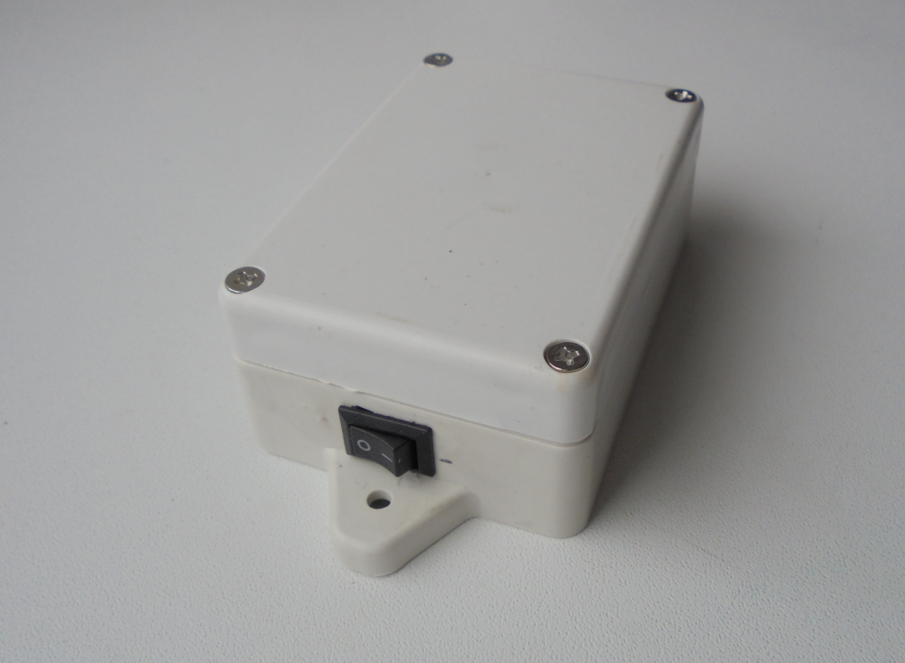

# SD_Track (rev2)

  
  

This device is an open source (both firmware and board level design) GPS data logger.  
You mount it with magnets on some vehicle, flip the power switch and the location  
data is saved onto SD card installed in the device. To increase battery life,  
device enters sleep mode when it sees no movement for 60 seconds and when some  
activity is detected it starts to save new incoming data in a new file. Files are  
named TRK*.TXT, where * is a number of the track. Files are named in the order they  
are created. After enough data was saved, you retrieve the device and convert the nmea  
dump files in a gpx format file (with a program such as [gpsbabel](https://www.gpsbabel.org)) and then you feed  
the gpx file to some analysis software (example: [viking](https://sourceforge.net/projects/viking)). All these example softwares  
are open source and available for many OS types.  

[video description]()  

---

## hardware
project is designed using KiCad 5.0.0  
check KiCad pcb file for PCB manufacturing info  
check KiCad sch file component fields + BOM.txt for component info  

programmer device used in this project is [ST-Link V2](https://www.aliexpress.com/item/1PCS-ST-LINK-Stlink-ST-Link-V2-Mini-STM8-STM32-Simulator-Download-Programmer-Programming-With-Cover/32792513237.html?ws_ab_test=searchweb0_0,searchweb201602_2_10152_10151_10065_10344_10068_10342_10546_10343_10340_10548_10341_10696_10084_10083_10618_10307_10135_10133_10059_100031_10103_10624_10623_10622_10621_10620,searchweb201603_55,ppcSwitch_3&algo_expid=448b8f37-4a09-4701-bf7f-8b2ce2770a23-0&algo_pvid=448b8f37-4a09-4701-bf7f-8b2ce2770a23&priceBeautifyAB=0)  
you can use single pin female-female jumpers or a 20cm 1x5pin [jumper cable](https://www.aliexpress.com/item/10PCS-5PIN-DUPONT-LINE-female-to-female-PITCH-2-54MM-20CM-double-head-5P-5-pin/32853674233.html?ws_ab_test=searchweb0_0,searchweb201602_2_10152_10151_10065_10344_10068_10342_10546_10343_10340_10548_10341_10696_10084_10083_10618_10307_10135_10133_10059_100031_10103_10624_10623_10622_10621_10620,searchweb201603_55,ppcSwitch_3&algo_expid=c2221a02-3143-4d59-b79a-f27b48f8f268-0&algo_pvid=c2221a02-3143-4d59-b79a-f27b48f8f268&priceBeautifyAB=0)  
make sure to plug the programming cable into the header the right way  

SIM28 comes in several variants which have different UART speeds by default.  
Firmare here expects 9600 baudrate version. if you have different module version  
modify USART1 baud rate configuration in /firmware/main/main.c file (USART1->BRR line)  

To retrieve data from SD card you will need an SD card reader (recommended), or use  
your phone as a USB disk. SD card must be formatted as a FAT filesystem and the files  
are saved in first partition by default.  

USB socket on the board is used for battery charging only.  
current consumption while tracking is 40mA; while waiting for activity less than 1mA.  
lowest acceptable battery voltage is approximately 3V, if lower voltage is detected,  
the device turns off until the power switch is reset (off) and battery recharged.  

## firmware
firmware was developed on debian 10 (buster) system, using gcc-arm-none-eabi toolchain (compiler, linker,  
binutils) and does use gcc specific extentions. was successfully compiled and tested with gcc version 6.3.1  

flashing software used = openocd.  
IDE used = emacs text editor + Makefile  (you will need to have make utility installed)  
depends on newlib-nano, libnosys, libgcc. all these libraries, along with the linker script, startup code  
and openocd configuration files are included in this repository.  

for bulk conversion of TRK*.TXT files to GPX you can use GUI version of gpsbabel, or copy and  
then run bash script /firmware/bulkConvert.sh in the directory with TRK*.TXT files.  
This will produce TRACKS.GPX output file  

to build the firmware cd into the /firmware/ directory, then type:  

> make  

this will produce several output files, among which is firmware.bin  
this is a file that contains the firmware to flash. To do it,  
insert ST-LINKv2 programmer into the board, then into computer and type:  

> make upload  

## directories info

#### /firmware/ --------------- contains makefile, linker script, source files; this is a build directory  

/firmware/cmsis/ ---------- necessary header files from CMSIS compliant [STM32F0xx standard peripherals library](https://www.st.com/content/st_com/en/products/embedded-software/mcus-embedded-software/stm32-embedded-software/stm32-standard-peripheral-libraries/stsw-stm32048.html)  

/firmware/stdlib/ ---------- standard statically linked libraries (libgcc.a, libc_nano.a, libnosys.a)  

/firmware/openocd/ ------- standard configuration files for openocd  

/firmware/fatfs/ ----------- [chan fatfs](http://www.elm-chan.org/fsw/ff/00index_e.html) module for working with FAT filesystem + diskio.c, diskio.h (custom low level driver for SD card communication over SPI)  

/firmware/main/main.c ------- file that contains main application  
/firmware/main/support.c ------- file that contains interrupt vector table, IRQ handlers and startup code  

#### /hardware/ ------------------- contains KiCad project, schematic, PCB files  

/hardware/SD_Track.symbols/ -- project specific symbol library  

/hardware/SD_Track.pretty/ --- project specific footprint library  

/hardware/gerbers/ ----------- gerber+excellon fabrication output files  
