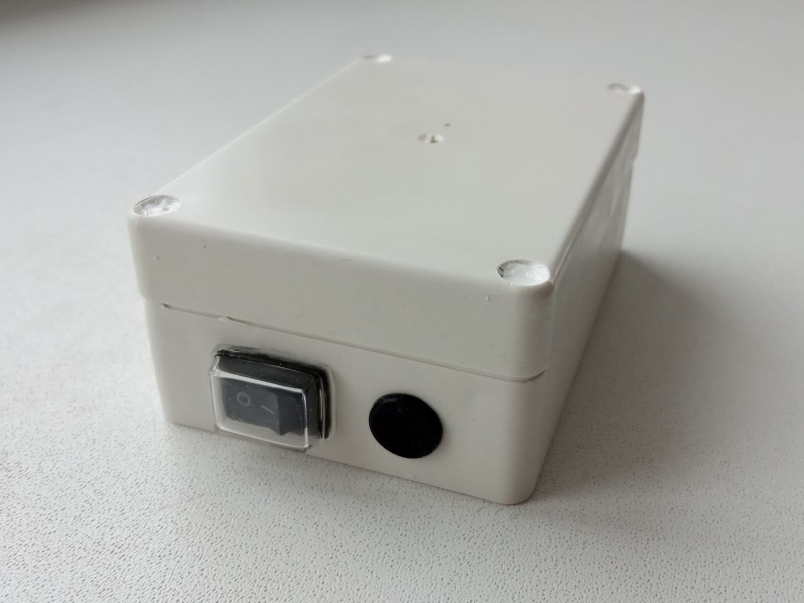
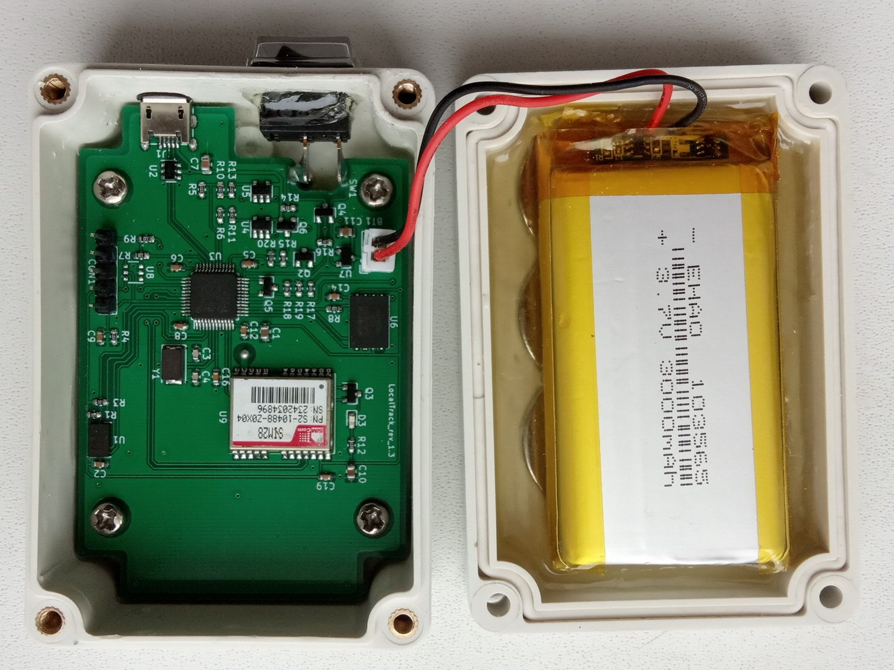

# LocalTrack  
  
  
  
  
This device is an open source (both firmware and board level design) GPS data logger.  
You mount it with built-in magnets on some vehicle, flip the power switch and the location  
data is saved into internal flash storage. After some tracks were recorded, you can  
retrieve the device again and extract GPX track files via USB. You can then pass these  
files into mapping/analysis software of your choise, for example [viking](https://sourceforge.net/projects/viking), to get an  
easy to work with representation of recorded location data.  
  
This device is intended for use in applications where real-time tracking is not required,  
but other advantages of network-disconnected design are desirable, such as:  
  
1. No need to pay your cellular service provider.  
  
2. Local file storage, so you don't have to trust your data to some proprietary  
manufacturer's software or depend on a particular service being provided.  
  
3. Logger is harder to detect; if discovered, it is hard to trace where it came from,  
as it does not have information like IMEI, IMSI, payment history, etc. linked to it.  
  
4. Less power consumption and longer battery life.  
  
**CHECK THE [WIKI](https://github.com/krakrukra/LocalTrack/wiki) FOR HOW-TO-USE INFORMATION**  
  
---
  
## hardware
  
Project is designed using KiCad 6.0.11  
Check KiCad pcb file for PCB manufacturing info  
Check KiCad sch file + BOM.txt for component info  
  
Uses integrated full-speed (12Mbit/s) USB2.0 peripheral, with  
96MiB of available on-board flash memory for data storage;  
measured speeds for MSD access: read 800-850 KiB/s, write 700-750 KiB/s  
  
Hardware programmer device used in this project is [ST-Link V2](https://www.aliexpress.com/item/1823628996.html)  
  
SIM28 may come in several variants which have different USART speeds by default.  
Firmare here expects 9600 baudrate version. If you have different module version  
you will need to modify USART1 configuration in main.c and peripheral.c files.  
  
Device has a 3000mAh li-po battery and can function with battery voltage above 3V.  
If lower voltage is detected, device enters low battery mode and waits until  
the battery is recharged. Current consumption while tracking is around 40mA;  
while waiting in sleepmode (eg. due to lack of movement) it is less than 1mA.  
This results in about 70 hours of active tracking before battery is depleted.  
Battery can be charged via USB with up to 1A of current, so make sure to pick  
capable charging adapter and USB cable. Also, keep in mind that you will need  
a cable with extra long 8mm micro USB plug, instead of the usual 5.4mm plug.  
  
## firmware  
  
Programming language used = C  
Flashing software used = openocd 0.12.0  
IDE used = emacs text editor + Makefile  
  
The firmware was developed on debian 11.3 system, using gcc-arm-none-eabi  
toolchain (compiler, linker, binutils) and it does use gcc specific extentions.  
it was successfully compiled and tested with arm-none-eabi-gcc version 12.2.1  
  
Depends on libgcc.a, which is included in this repository. linker script,  
startup code and openocd configuration files are included here as well.  
  
For easy in-field updates, you can use the DFU bootloader. There is a dfu  
firmware image available in **/firmware/firmware\_RRNNN.dfu** file. The name  
format is this: RR stands for board revision (13 = rev 1.3) , NNN stands  
for firmware version. For example, firmware\_13001.dfu means board  
revision 1.3, firmware version 1  
  
  
To automate firmware build process you can use make utility. If you  
open terminal in **/firmware/** directory, you could run these commands:  
  
> make  
> make upload  
> make dfu  
> make clean  
  
"make" will compile source code and create several files, among them  
is firmware.bin which contains firmware to flash. "make upload" will  
flash this file via St-Link V2 programmer. Make sure to connect the  
programmer to the board properly, before you plug it into PC and run the  
command. "make dfu" will create a DFU firmware image from firmware.bin  
which can be used later by DFU flashing software. "make clean" will  
delete all the compiled or temporary files created by previous commands.  
  
## directories info  
  
#### /firmware/ ------------- contains makefile, linker script, source files; this is a build directory  
/firmware/cmsis/ ------- header files from CMSIS compliant [STM32F0xx standard peripherals library](https://www.st.com/content/st_com/en/products/embedded-software/mcus-embedded-software/stm32-embedded-software/stm32-standard-peripheral-libraries/stsw-stm32048.html)  
/firmware/stdlib/ ---------- standard statically linked libraries (libgcc.a)  
/firmware/openocd/ ------- standard configuration files for openocd 0.12.0  
/firmware/fatfs/ ---------- [chan fatfs](http://www.elm-chan.org/fsw/ff/00index_e.html) filesystem module + W25N01GVZEIG disk driver  
/firmware/usb/ ------------ USB system and MSD class device implementation  
/firmware/main/ ------- main application files, interrupt vector table, IRQ handlers and startup code  
/firmware/dfuse-pack.py ------- python script to create .dfu firmware images  
/firmware/linkScript.ld ------- custom linker script for the GNU linker (ld)  
/firmware/Makefile ------- file used by GNU make utility for build automation  
/firmware/firmware_13NNN.dfu ------ pre-compiled firmware image in DfuSe format (STM32)  
  
#### /hardware/ ------------------- contains KiCad project, schematic, PCB files  
/hardware/LocalTrack.symbols/ ---- project specific symbol library  
/hardware/LocalTrack.pretty/ ----- project specific footprint library  
/hardware/gerbers/ ----------- gerber+excellon fabrication output files  
/hardware/BOM.txt --------- list of parts and accessories needed for DIY assembly  
  
#### /mechanical/ ------------------- contains device's mechanical information  
/mechanical/drawings/ ---- mechanical drawings for some of the parts  
/mechanical/KH-F20.FCStd --- freecad model for the plastic enclosure  
  
#### /extra/ -------------------  contains pictures, documentation, etc.  
/extra/photos/ ---------------- photos or the device  
/extra/wiki/ ------------------ github wiki pages  
  
## contact info  
  
if you have a problem / question / feature request, here are your options for contacting me:  
send me an email to krakrukra@tutanota.com  
create a new github issue (check [closed issues](https://github.com/krakrukra/LocalTrack/issues?q=is%3Aissue+is%3Aclosed) first)  
also, you can check out my [youtube channel](https://www.youtube.com/channel/UC8HZCV1vNmZvp7ci1vNmj7g)  
  
For extra security, you could use my PGP public key saved in [/extra/pubkey.asc](https://github.com/krakrukra/LocalTrack/blob/master/extra/pubkey.asc).  
  
#### if you want to buy:  
  
not available for sale yet; put store link here  
  